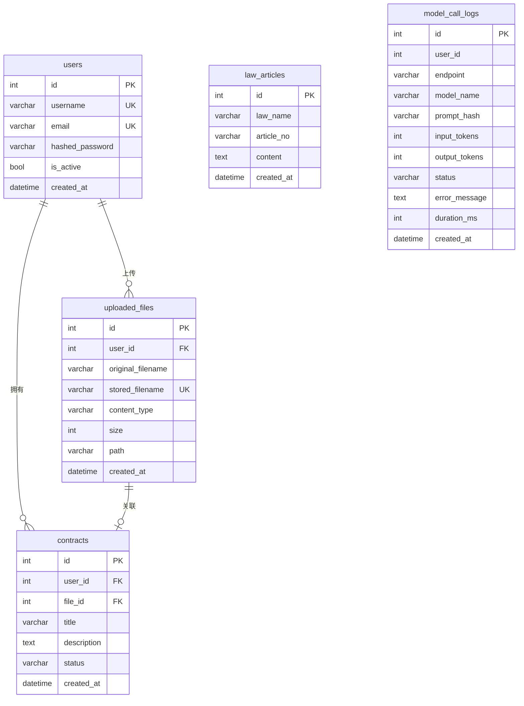

# 数据库表结构设计（SQLite / SQLAlchemy）

> 说明：本项目为大创交付优先，先落地核心实体（用户、合同、法条、模型调用记录、文件上传记录）。后续如需扩展字段/索引可在此文档增量维护。

---

## ER 图

---

## 1. users（用户表）
- **id**: int PK
- **username**: varchar(50) UNIQUE, INDEX
- **email**: varchar(255) UNIQUE, INDEX, 可空
- **hashed_password**: varchar(255)
- **is_active**: bool，默认 true
- **created_at**: datetime

## 2. uploaded_files（文件上传记录）
- **id**: int PK
- **user_id**: int FK -> users.id, INDEX
- **original_filename**: varchar(255)
- **stored_filename**: varchar(255) UNIQUE, INDEX（uuid_原文件名）
- **content_type**: varchar(100), 可空
- **size**: int（字节数）
- **path**: varchar(500)（本地保存路径）
- **created_at**: datetime

## 3. contracts（合同表）
- **id**: int PK
- **user_id**: int FK -> users.id, INDEX
- **file_id**: int FK -> uploaded_files.id, 可空, INDEX
- **title**: varchar(255)
- **description**: text, 可空
- **status**: varchar(50), 默认 draft, INDEX（如 draft/reviewed/signed 等）
- **created_at**: datetime

## 4. law_articles（法条表）
- **id**: int PK
- **law_name**: varchar(255), INDEX（法律名称）
- **article_no**: varchar(50), 可空, INDEX（条号，如“第一条”）
- **content**: text（法条正文）
- **created_at**: datetime

## 5. model_call_logs（模型调用记录）
- **id**: int PK
- **user_id**: int，可空（匿名调用时为空）
- **endpoint**: varchar(255)（调用的接口/模块标识）
- **model_name**: varchar(255)，可空
- **prompt_hash**: varchar(64)，可空（输入摘要）
- **input_tokens**: int 默认 0
- **output_tokens**: int 默认 0
- **status**: varchar(50) 默认 ok（ok/error）
- **error_message**: text，可空
- **duration_ms**: int 默认 0
- **created_at**: datetime

